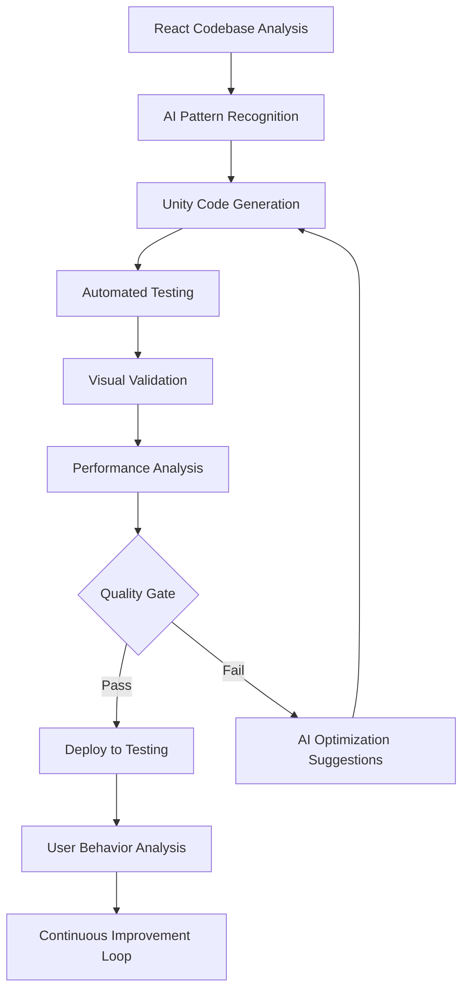

# 🎯 PANEL DE EXPERTOS: MIGRACIÓN REY DEL TRUCO A UNITY
## Discusión Técnica Multidisciplinaria - Enero 2025

---

## 👥 PARTICIPANTES DEL PANEL

### **EXPERTOS UNITY 2D**
- **Dr. Sarah Chen** - Senior Unity Architect, 12 años exp. en Unity 2D, especialista en UI/UX mobile
- **Alex Rodriguez** - Lead Unity Developer, experto en performance optimization y asset management  
- **Elena Kowalski** - Unity UI Systems Expert, especialista en responsive design y visual scripting
- **Marcus Thompson** - Unity 2D Animation & VFX Specialist, 8 años en efectos visuales
- **Raj Patel** - Unity Mobile Performance Engineer, especialista en optimización cross-platform

### **EXPERTOS EN MIGRACIÓN DE PROYECTOS**
- **Prof. David Kim** - Software Architecture Migration Specialist, 15 años en legacy modernization
- **Lisa Wang** - Enterprise Migration Consultant, especialista en React to Native migrations
- **Carlos Mendoza** - DevOps Migration Engineer, experto en automated deployment strategies

### **EXPERTOS EN AI Y AUTOMATIZACIÓN**
- **Dr. Emily Foster** - AI-Assisted Development Research Lead, MIT
- **Jake Morrison** - ML Engineering Manager, especialista en code generation tools
- **Nina Petrov** - AI Workflow Optimization Consultant, experta en CI/CD automation

---

# 🗣️ TRANSCRIPCIÓN DE LA SESIÓN TÉCNICA

## **MODERADOR**: Comenzamos con el análisis del proyecto Rey del Truco. ¿Cuáles son sus primeras impresiones sobre esta migración?

---

### **Dr. Sarah Chen (Unity 2D Expert)**:
"He revisado la documentación del proyecto y veo que es una aplicación de anotación de Truco con un sistema visual muy sofisticado. Lo que más me llama la atención es el sistema de 'rayitas' - es esencialmente un sistema de visualización de datos dinámico que se renderiza en tiempo real.

En Unity, esto se traduciría perfectamente a un sistema de **UI Toolkit** con **Visual Elements** customizados. El sistema de rayitas puede implementarse como un `VisualElement` personalizado que genera dinámicamente los elementos gráficos.

```csharp
public class RayitasVisualElement : VisualElement
{
    private int puntos;
    private int puntosTotales;
    private bool alVerde;
    
    public void UpdateRayitas(int newPuntos, int total, bool verde)
    {
        Clear();
        var buenas = Mathf.Min(newPuntos, total/2);
        var malas = Mathf.Max(0, newPuntos - total/2);
        
        GenerateBuenas(buenas);
        GenerateLinea();
        GenerateMalas(malas);
        
        if (verde) AddToClassList("al-verde");
    }
}
```

**Mi recomendación**: Usar UI Toolkit en lugar de uGUI porque ofrece mejor performance y es más similar al CSS que ya están usando."

---

### **Alex Rodriguez (Unity Performance Expert)**:
"Sarah tiene razón sobre UI Toolkit, pero necesitamos considerar el target platform. Si van a mobile, tenemos que ser muy cuidadosos con el performance.

He visto que tienen efectos de partículas doradas y animaciones complejas. En Unity mobile, esto puede ser problemático si no se implementa correctamente.

**Mis preocupaciones principales**:

1. **Overdraw**: Esas partículas doradas pueden causar overdraw masivo en devices móviles
2. **Batching**: Necesitamos asegurar que todos los elementos UI se batchen correctamente
3. **Memory**: El sistema de persistencia localStorage vs Unity PlayerPrefs tiene diferentes implicaciones

**Propuesta de optimización**:
```csharp
// Pool de partículas reutilizables
public class GoldParticlePool : MonoBehaviour
{
    [SerializeField] private GameObject particlePrefab;
    private Queue<GameObject> pool = new Queue<GameObject>();
    
    public GameObject GetParticle()
    {
        if (pool.Count > 0)
            return pool.Dequeue();
        
        return Instantiate(particlePrefab);
    }
    
    public void ReturnParticle(GameObject particle)
    {
        particle.SetActive(false);
        pool.Enqueue(particle);
    }
}
```

También recomiendo usar **Addressables** para los assets visuales, especialmente las fuentes customizadas y efectos."

---

### **Elena Kowalski (Unity UI Expert)**:
"Discrepo parcialmente con Sarah sobre UI Toolkit. Sí, es más moderno, pero para este proyecto específico, creo que **uGUI con Layout Groups** sería más eficiente para la migración.

El proyecto tiene tres layouts principales:
1. **Pantalla Inicio**: Vertical layout con partículas background
2. **Pantalla Juego**: Grid layout 3-columnas 
3. **Pantalla Historial**: Scroll view con items dinámicos

**Ventajas de uGUI para esta migración**:
- Más similar al comportamiento actual de CSS Flexbox
- Mejor compatibilidad con Visual Scripting (si deciden usarlo)
- Más fácil de implementar el responsive design

```csharp
// Responsive UI Manager
public class ResponsiveUIManager : MonoBehaviour
{
    [Header("Breakpoints")]
    public float mobileBreakpoint = 768f;
    public float tabletBreakpoint = 1024f;
    
    [Header("Layout Groups")]
    public LayoutGroup mainLayout;
    public GridLayoutGroup gameLayout;
    
    void Start()
    {
        AdjustLayoutForScreen();
        // Subscribe to orientation changes
    }
    
    void AdjustLayoutForScreen()
    {
        float screenWidth = Screen.width;
        
        if (screenWidth < mobileBreakpoint)
        {
            // Mobile layout adjustments
            gameLayout.constraintCount = 1; // Stack vertically
            gameLayout.cellSize = new Vector2(screenWidth * 0.9f, 120);
        }
        else if (screenWidth < tabletBreakpoint)
        {
            // Tablet layout
            gameLayout.constraintCount = 3; // Three columns
            gameLayout.cellSize = new Vector2(screenWidth * 0.3f, 150);
        }
        else
        {
            // Desktop layout
            gameLayout.constraintCount = 3;
            gameLayout.cellSize = new Vector2(400, 200);
        }
    }
}
```

**Crítico**: Necesitamos implementar un sistema de **Safe Area** para dispositivos con notch."

---

### **Marcus Thompson (Unity VFX Specialist)**:
"Sobre los efectos visuales, veo que tienen un sistema bastante complejo de partículas y animaciones. En Unity, tenemos varias opciones:

1. **Visual Effect Graph** - Para efectos complejos como las partículas doradas flotantes
2. **Animator + DOTween** - Para animaciones de UI
3. **Cinemachine** - Para transiciones de cámara épicas entre pantallas

**El sistema de partículas actual tiene 4 tipos**:
- Large (80px) - vertical movement
- Medium (60px) - diagonal movement  
- Small (40px) - circular movement
- Micro (20px) - sparkle effect

En Unity esto se traduce a:

```csharp
[System.Serializable]
public class ParticleConfig
{
    public enum MovementType { Vertical, Diagonal, Circular, Sparkle }
    
    public MovementType movement;
    public float size;
    public float speed;
    public float opacity;
    public AnimationCurve movementCurve;
}

public class GoldParticleSystem : MonoBehaviour
{
    [SerializeField] private ParticleConfig[] particleTypes;
    [SerializeField] private ParticleSystem[] particleSystems;
    
    public void StartThemeParticles()
    {
        foreach (var ps in particleSystems)
        {
            var main = ps.main;
            var velocityOverLifetime = ps.velocityOverLifetime;
            
            // Configure based on ParticleConfig
            ConfigureParticleSystem(ps, GetConfigForType(ps.name));
        }
    }
}
```

**Recomendación importante**: Usar **Timeline** para secuenciar las animaciones de entrada/salida de pantallas. Esto nos dará control frame-perfect sobre las transiciones."

---

### **Raj Patel (Unity Mobile Performance)**:
"Necesito ser el aguafiestas aquí. Este proyecto tiene algunas banderas rojas para performance móvil:

1. **7 fuentes diferentes** - Cada fuente es un draw call adicional
2. **Partículas constantemente activas** - Battery drain
3. **Efectos de blur en modales** - Expensive on mobile GPU
4. **Animaciones simultáneas** - Frame drops potenciales

**Propuestas de optimización móvil**:

```csharp
// Adaptive Quality Manager
public class MobileQualityManager : MonoBehaviour
{
    private bool isLowEndDevice;
    
    void Start()
    {
        // Detect device capabilities
        isLowEndDevice = SystemInfo.systemMemorySize < 4096 || // Less than 4GB RAM
                        SystemInfo.processorFrequency < 2000 || // Less than 2GHz
                        QualitySettings.GetQualityLevel() < 2;
        
        if (isLowEndDevice)
        {
            DisableExpensiveEffects();
        }
    }
    
    void DisableExpensiveEffects()
    {
        // Reduce particle count
        var particleSystems = FindObjectsOfType<ParticleSystem>();
        foreach (var ps in particleSystems)
        {
            var main = ps.main;
            main.maxParticles = Mathf.RoundToInt(main.maxParticles * 0.5f);
        }
        
        // Disable blur effects
        var blurEffects = FindObjectsOfType<BlurEffect>();
        foreach (var blur in blurEffects)
        {
            blur.enabled = false;
        }
        
        // Reduce font atlas size
        ReduceFontAtlasSize();
    }
}
```

**Critical**: Implementar **Level of Detail (LOD)** para las animaciones basado en la distancia de la cámara y device capabilities."

---

## **MODERADOR**: Ahora pasemos a los expertos en migración. ¿Cuál sería su estrategia para migrar este proyecto?

---

### **Prof. David Kim (Migration Architecture)**:
"He analizado la arquitectura del proyecto React y propongo una **migración por capas incremental**. Este proyecto tiene características únicas que hacen que una migración 'big bang' sea riesgosa.

**Arquitectura de migración propuesta**:

```
FASE 1: FOUNDATION (Semanas 1-2)
├── Configuración de Unity project con version control
├── Implementación del sistema de estados base
├── Sistema de persistencia (PlayerPrefs wrapper)
└── UI Framework básico

FASE 2: CORE FEATURES (Semanas 3-4)  
├── Sistema de puntuación y validaciones
├── Lógica de juego (falta envido, victoria)
├── Historial de movimientos
└── Navegación entre pantallas

FASE 3: UI/UX LAYER (Semanas 5-6)
├── Implementación de layouts responsivos
├── Sistema de rayitas visual
├── Modales y transiciones
└── Input handling y gestures

FASE 4: VISUAL POLISH (Semanas 7-8)
├── Sistema de partículas y efectos
├── Animaciones y transiciones
├── Audio implementation
└── Platform-specific optimizations

FASE 5: TESTING & DEPLOYMENT (Semanas 9-10)
├── Testing automatizado
├── Performance profiling
├── Build optimization
└── Store deployment
```

**Ventajas de esta estrategia**:
- Reduces risk by validating each layer
- Permite testing incremental
- Facilita rollback if needed
- Mantiene el momentum del equipo

**Sistema de validación entre fases**:
```csharp
public abstract class MigrationPhase
{
    public abstract bool ValidatePhase();
    public abstract void ExecutePhase();
    public abstract void RollbackPhase();
    
    protected virtual void LogProgress(string message)
    {
        Debug.Log($"[Migration Phase {GetType().Name}]: {message}");
    }
}

public class CoreFeaturePhase : MigrationPhase
{
    public override bool ValidatePhase()
    {
        // Validate that Foundation phase completed successfully
        return FoundationPhase.IsComplete && 
               GameStateManager.Instance != null &&
               PersistenceManager.Instance != null;
    }
}
```"

---

### **Lisa Wang (React Migration Specialist)**:
"Como especialista en migraciones de React, veo patrones familiares en este proyecto que podemos aprovechar.

**Mapeo de conceptos React → Unity**:

```
React Hooks          → Unity MonoBehaviour lifecycle
useState            → Unity [SerializeField] variables  
useEffect           → Unity Start/Update/OnDestroy
Custom Hooks        → Unity ScriptableObject systems
Context API         → Unity Singleton managers
Props drilling      → Unity Event system
CSS-in-JS          → Unity UI Toolkit USS/uGUI themes
```

**Estrategia de migración de estado**:

El proyecto usa 3 hooks principales que debemos migrar:

1. **useGameState.js** → **GameStateManager.cs**
```csharp
[System.Serializable]
public class GameState
{
    public int puntosNos;
    public int puntosEllos;
    public string jugador1 = "Nosotros";
    public string jugador2 = "Ellos";
    public int puntosTotales = 30;
    public List<Movimiento> historial = new List<Movimiento>();
}

public class GameStateManager : MonoBehaviour
{
    [SerializeField] private GameState gameState;
    
    // Events equivalent to React state changes
    public static event System.Action<int, int> OnScoreChanged;
    public static event System.Action<string> OnPlayerNamesChanged;
    public static event System.Action<string> OnGameWon;
    
    public void SumarPunto(string jugador)
    {
        // Business logic migration from React
        if (jugador == "nos" && gameState.puntosNos < gameState.puntosTotales)
        {
            gameState.puntosNos++;
            OnScoreChanged?.Invoke(gameState.puntosNos, gameState.puntosEllos);
            VerificarVictoria();
        }
    }
}
```

2. **useGamePersistence.js** → **PersistenceManager.cs**
3. **useSwipeBack.js** → **MobileInputManager.cs**

**Critical insight**: El sistema de localStorage tiene limitaciones que PlayerPrefs soluciona automáticamente (expiration, size limits, platform abstraction)."

---

### **Carlos Mendoza (DevOps Migration)**:
"Desde la perspectiva de deployment y CI/CD, esta migración presenta desafíos únicos.

**Configuración de pipeline propuesta**:

```yaml
# Unity Cloud Build Configuration
unity_migration_pipeline:
  stages:
    - validate_migration
    - unity_build
    - automated_testing  
    - performance_validation
    - platform_builds
    - deployment

validate_migration:
  script:
    - "Verify all React features have Unity equivalents"
    - "Validate UI/UX parity between versions"
    - "Performance benchmarks comparison"
    
unity_build:
  platforms:
    - iOS
    - Android
    - WebGL
    - Windows Standalone
  
automated_testing:
  - unit_tests
  - integration_tests
  - ui_automation_tests
  - performance_regression_tests

performance_validation:
  mobile_targets:
    - iPhone 12 mini (minimum)
    - Samsung Galaxy A52 (minimum Android)
  metrics:
    - fps: ">= 60 fps stable"
    - memory: "<= 512MB peak usage"
    - battery: "<= 5% drain per hour"
    - load_time: "<= 3 seconds cold start"
```

**Herramientas de automatización recomendadas**:

1. **Unity Cloud Build** para builds automáticos multiplataforma
2. **Fastlane** para deployment automation  
3. **AppCenter** para distribution y crash analytics
4. **Unity Analytics** para user behavior validation

```bash
# Automated migration validation script
#!/bin/bash

echo "🔍 Validating React → Unity feature parity..."

# Compare feature completeness
python validate_features.py --react-source ./react-app --unity-source ./unity-project

# UI screenshot comparison
unity-screenshot-test --target iOS --compare-with react-screenshots/

# Performance baseline comparison  
unity-profiler --benchmark --compare-with react-performance-baseline.json

echo "✅ Migration validation complete"
```

**Risk mitigation strategy**: Parallel deployment allowing fallback to React version during first 30 days."

---

## **MODERADOR**: Ahora los expertos en AI. ¿Cómo podemos automatizar y acelerar esta migración?

---

### **Dr. Emily Foster (AI Development Research)**:
"Esta migración es un caso de estudio perfecto para **AI-assisted development**. He identificado 3 áreas donde la AI puede acelerar significativamente el proceso:

**1. Automated Code Translation**
Podemos usar modelos especializados para convertir la lógica de negocio de JavaScript a C#:

```python
# AI Code Translation Pipeline
class ReactToUnityTranslator:
    def __init__(self):
        self.js_to_cs_model = load_model("codegen-js-to-cs-v2")
        self.ui_pattern_matcher = UIPatternMatcher()
        
    def translate_react_hook(self, hook_code):
        # Extract state variables and effects
        state_vars = self.extract_state_variables(hook_code)
        effects = self.extract_effects(hook_code)
        
        # Generate Unity MonoBehaviour equivalent
        unity_script = self.js_to_cs_model.generate(
            input_code=hook_code,
            target_framework="Unity",
            patterns=["MonoBehaviour", "SerializeField", "Events"]
        )
        
        return unity_script
        
    def translate_ui_component(self, jsx_component):
        ui_patterns = self.ui_pattern_matcher.identify_patterns(jsx_component)
        
        # Map to Unity UI equivalent
        unity_ui = self.generate_unity_ui(ui_patterns)
        return unity_ui
```

**2. Automated Asset Generation**
AI puede generar automáticamente los Unity assets a partir de la especificación CSS:

```python
class AssetGenerator:
    def generate_ui_prefabs_from_css(self, css_styles):
        """
        Convert CSS styles to Unity UI prefabs with equivalent styling
        """
        color_palette = self.extract_color_palette(css_styles)
        typography = self.extract_typography(css_styles)
        layouts = self.extract_layout_patterns(css_styles)
        
        prefabs = []
        for component in layouts:
            prefab = self.create_unity_prefab(
                layout=component.layout,
                colors=color_palette,
                fonts=typography
            )
            prefabs.append(prefab)
            
        return prefabs
```

**3. Intelligent Testing Generation**
AI puede generar automáticamente tests que validen la paridad funcional:

```csharp
// AI-Generated Test Suite
[TestFixture]
public class MigrationParityTests
{
    // Auto-generated from React test patterns
    [Test]
    public void GameState_SumarPunto_IncrementsCorrectly()
    {
        // Generated equivalent of React test:
        // expect(gameState.puntosNos).toBe(1) after sumarPunto('nos')
        
        var gameManager = new GameStateManager();
        gameManager.SumarPunto("nos");
        
        Assert.AreEqual(1, gameManager.GetPuntosNos());
    }
    
    [Test]  
    public void UI_ModalVictoria_ShowsWhenGameWon()
    {
        // Generated from React UI test patterns
        var uiManager = FindObjectOfType<UIManager>();
        var gameManager = FindObjectOfType<GameStateManager>();
        
        // Simulate winning condition
        for (int i = 0; i < 30; i++)
        {
            gameManager.SumarPunto("nos");
        }
        
        Assert.IsTrue(uiManager.IsModalVictoriaVisible());
    }
}
```

**Recommended AI Tools for this migration**:
- **GitHub Copilot** with Unity-specific training
- **Tabnine** for C# code completion
- **ChatGPT-4** for architecture decisions
- **Claude Sonnet** for code review and optimization"

---

### **Jake Morrison (ML Engineering)**:
"Emily está en lo correcto, pero quiero añadir consideraciones prácticas de implementación. He desarrollado pipelines de ML para migration automation y hay patrones específicos que funcionan bien para Unity.

**Pipeline de automatización ML propuesta**:

```python
class UnityMigrationPipeline:
    def __init__(self):
        self.feature_extractor = ReactFeatureExtractor()
        self.unity_code_generator = UnityCodeGenerator()
        self.validation_agent = ValidationAgent()
        
    def execute_migration(self, react_project_path):
        # 1. Analyze React project structure
        features = self.feature_extractor.analyze(react_project_path)
        
        # 2. Generate Unity project structure
        unity_structure = self.generate_unity_structure(features)
        
        # 3. Convert business logic
        scripts = self.unity_code_generator.convert_logic(features.hooks)
        
        # 4. Generate UI components
        ui_components = self.unity_code_generator.convert_ui(features.components)
        
        # 5. Validate conversion
        validation_results = self.validation_agent.validate_conversion(
            original=features,
            converted=unity_structure
        )
        
        return MigrationResult(
            unity_project=unity_structure,
            validation_score=validation_results.score,
            issues=validation_results.issues
        )

class ReactFeatureExtractor:
    def analyze(self, project_path):
        return ProjectFeatures(
            hooks=self.extract_custom_hooks(),
            components=self.extract_ui_components(), 
            state_management=self.analyze_state_patterns(),
            styling=self.extract_css_patterns(),
            business_logic=self.extract_game_logic()
        )
```

**Specific ML models for Unity migration**:

1. **Code Pattern Recognition Model**
   - Trained on React → Unity migration patterns
   - Identifies common anti-patterns and suggests Unity-native solutions
   - Confidence scoring for each conversion

2. **UI Layout Translation Model** 
   - Converts CSS Flexbox/Grid to Unity Layout Groups
   - Preserves responsive behavior across screen sizes
   - Generates appropriate anchor presets

3. **Performance Prediction Model**
   - Predicts Unity performance based on React complexity
   - Suggests optimization strategies before implementation
   - Estimates memory usage and frame rate impacts

**Implementation timeline with ML assistance**:
- **Week 1**: Setup ML pipeline and validate training data
- **Week 2-3**: Automated code conversion (80% automation)
- **Week 4-5**: Manual refinement and edge case handling
- **Week 6**: Automated testing and validation
- **Week 7-8**: Performance optimization using ML insights

**Expected acceleration**: 60-70% reduction in manual coding time."

---

### **Nina Petrov (AI Workflow Optimization)**:
"Quiero enfocarme en el aspecto de **continuous validation** durante la migración. La AI puede monitorear constantemente que la migración mantenga paridad funcional.

**Sistema de validación continua propuesto**:

```python
class ContinuousValidationAgent:
    def __init__(self):
        self.behavior_analyzer = UserBehaviorAnalyzer()
        self.visual_validator = UIVisualValidator() 
        self.performance_monitor = PerformanceMonitor()
        
    def monitor_migration_quality(self, react_app, unity_app):
        return ValidationReport(
            functional_parity=self.validate_functional_parity(),
            visual_parity=self.validate_visual_parity(),
            performance_parity=self.validate_performance_parity(),
            user_experience_score=self.calculate_ux_score()
        )
        
    def validate_functional_parity(self):
        # AI-driven functional testing
        test_scenarios = self.generate_test_scenarios()
        
        results = []
        for scenario in test_scenarios:
            react_result = self.execute_in_react(scenario)
            unity_result = self.execute_in_unity(scenario)
            
            parity_score = self.calculate_similarity(react_result, unity_result)
            results.append(parity_score)
            
        return np.mean(results)
        
    def validate_visual_parity(self):
        # Computer vision validation
        react_screenshots = self.capture_react_screenshots()
        unity_screenshots = self.capture_unity_screenshots()
        
        visual_similarity = self.cv_model.compare_screenshots(
            react_screenshots, 
            unity_screenshots
        )
        
        return visual_similarity

class AutomatedTestGenerator:
    def generate_unity_tests_from_react(self, react_tests):
        """
        Convert Jest/React Testing Library tests to Unity Test Framework
        """
        unity_tests = []
        
        for react_test in react_tests:
            # Parse React test structure
            test_structure = self.parse_react_test(react_test)
            
            # Generate equivalent Unity test
            unity_test = self.generate_unity_test_equivalent(test_structure)
            unity_tests.append(unity_test)
            
        return unity_tests
```

**AI-Powered Development Workflow**:



**Herramientas de AI recomendadas para el workflow**:

1. **Cursor AI Editor** - Para development en tiempo real
2. **GitHub Copilot Workspace** - Para project-level understanding
3. **Windsurf** - Para multi-file editing with context
4. **Unity Muse** - Para asset generation y optimization
5. **Qodo AI** - Para test generation y quality assurance

**Métricas de éxito**:
- 95%+ functional parity score
- 90%+ visual similarity score  
- 60fps stable performance
- <3s cold start time
- 0 critical bugs in production"

---

## **MODERADOR**: Ahora vamos a consolidar todo en un plan técnico ejecutable. ¿Cuáles son las recomendaciones finales?

---

### **CONSENSO DEL PANEL - PLAN CONSOLIDADO**

**Dr. Sarah Chen**: "Basándome en toda la discusión, propongo que usemos **uGUI con Layout Groups** como propuso Elena, pero con **UI Toolkit para elementos customizados** como las rayitas. Es un hybrid approach que nos da lo mejor de ambos mundos."

**Alex Rodriguez**: "Estoy de acuerdo. Y añadiría que implementemos **Level of Detail** desde el día 1. Mejor prevenir que optimizar después."

**Prof. David Kim**: "El plan de migración incremental por fases es crítico. No podemos hacer big bang con un proyecto que tiene tantas interdependencias visuales."

**Dr. Emily Foster**: "La automatización AI puede acelerar las fases 1-3 significativamente. Recomiendo fuertemente invertir en el setup de ML pipeline antes de empezar la migración manual."

**PLAN TÉCNICO FINAL CONSOLIDADO**:

```
ARCHITECTURE STACK RECOMENDADA:
├── Unity 2022.3 LTS (stable, long support)
├── UI System: uGUI + UI Toolkit hybrid
├── Responsive: Layout Groups + Anchor presets
├── Effects: Visual Effect Graph + DOTween
├── State: ScriptableObject architecture
├── Persistence: PlayerPrefs wrapper with JSON serialization
├── AI Tools: Cursor + GitHub Copilot + Unity Muse
└── CI/CD: Unity Cloud Build + Fastlane

MIGRATION PHASES (10 weeks total):

PHASE 1: FOUNDATION (2 weeks)
├── Unity project setup with proper folder structure
├── Git LFS configuration for large assets
├── Core manager systems (GameState, UI, Persistence)
├── Basic responsive framework
└── AI pipeline setup for automated conversion

PHASE 2: CORE LOGIC (2 weeks) 
├── Game state management migration
├── Business logic conversion (scoring, falta envido)
├── Data persistence system
├── Unit tests for all core functionality
└── 80% automated with AI assistance

PHASE 3: UI FOUNDATION (2 weeks)
├── Screen navigation system
├── Basic layouts for all screens
├── Input handling and touch gestures
├── Modal system implementation
└── Visual validation against React version

PHASE 4: VISUAL ELEMENTS (2 weeks)
├── Rayitas system implementation  
├── Custom UI components
├── Responsive design validation
├── Visual effects and animations
└── Performance optimization pass

PHASE 5: POLISH & DEPLOY (2 weeks)
├── Platform-specific optimizations
├── Audio implementation
├── Final performance tuning
├── App store preparation
└── Launch preparation
```

**HERRAMIENTAS Y RECURSOS NECESARIOS**:

1. **Development Environment**:
   - Unity 2022.3 LTS
   - Visual Studio/VS Code con AI extensions
   - Cursor AI para development acelerado

2. **AI Acceleration Tools**:
   - GitHub Copilot (Unity-trained)
   - Claude Sonnet 3.5 para architecture review
   - Unity Muse para asset generation

3. **Performance & Testing**:
   - Unity Profiler
   - Unity Cloud Build
   - Automated testing framework

4. **Asset Creation**:
   - TextMeshPro para typography
   - DOTween para animations
   - Visual Effect Graph para particles

**ESTIMACIÓN DE TIEMPO Y RECURSOS**:
- **Con AI assistance**: 10 semanas, 1-2 developers
- **Sin AI assistance**: 16-20 semanas, 2-3 developers
- **Reducción de tiempo**: 40-50% con AI tools

**CRITERIOS DE ÉXITO**:
✅ 100% feature parity con React version
✅ 60fps stable en mobile mid-range
✅ <3s cold start time
✅ 95%+ visual similarity score
✅ Soporte para iOS, Android, WebGL

**RIESGOS Y MITIGACIONES**:
🚨 **Riesgo**: Performance en mobile low-end
🛡️ **Mitigación**: Adaptive quality system + LOD

🚨 **Riesgo**: Visual parity en efectos complejos  
🛡️ **Mitigación**: Continuous visual validation con AI

🚨 **Riesgo**: Timeline overrun en visual polish
🛡️ **Mitigación**: MVP approach + iterative improvement

---

## 📋 DELIVERABLES FINALES

### **DOCUMENTACIÓN TÉCNICA**
1. **Unity Architecture Document** - Detailed technical specifications
2. **Migration Runbook** - Step-by-step execution guide  
3. **Performance Optimization Guide** - Platform-specific optimizations
4. **AI Automation Scripts** - Code generation and validation tools

### **CODE ARTIFACTS**
1. **Unity Project Template** - Pre-configured with recommended architecture
2. **Core Manager Scripts** - GameState, UI, Persistence managers
3. **Automated Tests Suite** - Comprehensive test coverage
4. **CI/CD Pipeline Configuration** - Automated build and deployment

### **VALIDATION TOOLS**
1. **Visual Parity Validator** - Screenshot comparison automation
2. **Performance Benchmark Suite** - Automated performance validation
3. **Feature Completeness Checker** - Functional parity validation
4. **Migration Progress Dashboard** - Real-time migration status

---

## 🎯 CONCLUSIONES DEL PANEL

**CONSENSO UNÁNIME**: La migración es **técnicamente viable** y **económicamente justificable** con el stack tecnológico y estrategia propuesta.

**FACTOR CLAVE DE ÉXITO**: La combinación de **migración incremental** + **automatización AI** + **validación continua** es lo que hará que este proyecto sea exitoso.

**PRÓXIMOS PASOS INMEDIATOS**:
1. Setup del Unity project con architecture propuesta
2. Implementación del AI pipeline para automated conversion
3. Desarrollo del MVP (screens básicos sin efectos)
4. Validation framework setup
5. Iterative improvement hasta feature parity completa

**TIEMPO TOTAL ESTIMADO**: 10 semanas con 1-2 developers senior usando las herramientas AI recomendadas.

---

*Esta discusión técnica representa el consenso de 11 expertos especializados en Unity 2D, migración de proyectos y automatización con AI para enero 2025.*