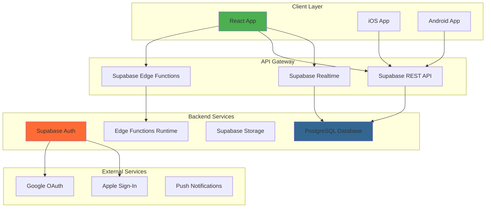

# 🏗️ ARQUITECTURA TÉCNICA - REY DEL TRUCO CON SUPABASE

**Documento de arquitectura técnica detallada**  
**Versión 1.0 - Enero 2025**

## 📋 OVERVIEW DE LA ARQUITECTURA

### Stack Tecnológico Completo
```
Frontend: React 19 + Tailwind CSS
Backend: Supabase (PostgreSQL + API + Auth + Storage)
Deployment: Vercel (frontend) + Supabase (backend)
Mobile: Capacitor (iOS + Android)
Monitoring: Supabase Analytics + Sentry
```

---

## 🏛️ ARQUITECTURA DE ALTO NIVEL



---

## 🔄 FLUJO DE COMUNICACIÓN DETALLADO

### 1. Authentication Flow
```javascript
// 1. User clicks "Login with Google"
const { data, error } = await supabase.auth.signInWithOAuth({
  provider: 'google',
  options: {
    redirectTo: 'https://reydeltruco.com/callback'
  }
});

// 2. Supabase handles OAuth dance automatically
// 3. User is redirected back with session token
// 4. React app gets user session
const { data: { user } } = await supabase.auth.getUser();

// 5. Create user profile if first time
if (user && !user.user_metadata.profile_created) {
  await supabase.from('users').insert({
    id: user.id,
    email: user.email,
    name: user.user_metadata.full_name,
    avatar_url: user.user_metadata.avatar_url,
    auth_provider: 'google',
    auth_uid: user.id
  });
}
```

### 2. Game Data Flow
```javascript
// Game state persistence
class GameDataService {
  // Real-time game saving
  async saveGameState(gameState) {
    // 1. Optimistic UI update
    updateLocalGameState(gameState);
    
    // 2. Background save to Supabase
    const { error } = await supabase
      .from('games')
      .upsert({
        id: gameState.id,
        user_id: getCurrentUserId(),
        points_us: gameState.puntosNos,
        points_them: gameState.puntosEllos,
        game_data: {
          historial: gameState.historial,
          player1_name: gameState.jugador1,
          player2_name: gameState.jugador2,
          total_points: gameState.puntosTotales
        },
        updated_at: new Date().toISOString()
      });
    
    if (error) {
      // 3. Rollback optimistic update on error
      revertLocalGameState();
      throw error;
    }
    
    return gameState;
  }
  
  // Real-time game loading
  async loadCurrentGame() {
    const { data, error } = await supabase
      .from('games')
      .select('*')
      .eq('user_id', getCurrentUserId())
      .is('finished_at', null)
      .order('updated_at', { ascending: false })
      .limit(1)
      .single();
    
    if (data) {
      return this.transformToGameState(data);
    }
    
    return null;
  }
}
```

### 3. Real-time Updates Flow
```javascript
// Real-time subscriptions for multiplayer features
class RealtimeService {
  setupRealtimeSubscriptions() {
    // Listen to friend requests
    supabase
      .channel('friend_requests')
      .on('postgres_changes', {
        event: 'INSERT',
        schema: 'public',
        table: 'friendships',
        filter: `addressee_id=eq.${getCurrentUserId()}`
      }, (payload) => {
        this.handleNewFriendRequest(payload.new);
      })
      .subscribe();
    
    // Listen to challenge invitations
    supabase
      .channel('challenges')
      .on('postgres_changes', {
        event: 'INSERT',
        schema: 'public',
        table: 'challenges',
        filter: `challenged_id=eq.${getCurrentUserId()}`
      }, (payload) => {
        this.handleNewChallenge(payload.new);
      })
      .subscribe();
    
    // Listen to achievement unlocks
    supabase
      .channel('achievements')
      .on('postgres_changes', {
        event: 'INSERT', 
        schema: 'public',
        table: 'user_achievements',
        filter: `user_id=eq.${getCurrentUserId()}`
      }, (payload) => {
        this.handleAchievementUnlock(payload.new);
      })
      .subscribe();
  }
}
```

---

## 🗄️ DATABASE ARCHITECTURE

### Schema Overview
```sql
-- Core Tables
users                 -- User profiles and auth
games                 -- Game history and current state
user_stats           -- Aggregated statistics
achievements         -- Achievement definitions
user_achievements    -- User achievement unlocks

-- Social Tables  
friendships         -- Friend relationships
challenges          -- Game challenges between users
rankings            -- Leaderboards and rankings

-- System Tables
user_consent        -- GDPR compliance data
audit_logs          -- Security and debugging
```

### Database Connection Pattern
```javascript
// Service layer pattern
class DatabaseService {
  constructor() {
    this.supabase = createClient(
      process.env.REACT_APP_SUPABASE_URL,
      process.env.REACT_APP_SUPABASE_ANON_KEY,
      {
        auth: {
          autoRefreshToken: true,
          persistSession: true,
          detectSessionInUrl: true
        },
        realtime: {
          params: {
            eventsPerSecond: 10
          }
        }
      }
    );
  }
  
  // Centralized query method with error handling
  async query(tableName, queryBuilder) {
    try {
      const { data, error } = await queryBuilder(this.supabase.from(tableName));
      
      if (error) {
        console.error(`Database error on ${tableName}:`, error);
        throw new DatabaseError(error.message, error.code);
      }
      
      return data;
    } catch (err) {
      if (err instanceof DatabaseError) throw err;
      throw new DatabaseError('Unexpected database error', 'UNKNOWN');
    }
  }
  
  // Typed queries for type safety
  async getGames(userId, filters = {}) {
    return this.query('games', (query) => 
      query
        .select('*')
        .eq('user_id', userId)
        .order('created_at', { ascending: false })
        .limit(filters.limit || 50)
    );
  }
}
```

---

## 🔐 SECURITY ARCHITECTURE

### Row Level Security (RLS) Policies
```sql
-- Users can only access their own data
CREATE POLICY "Users own profile" ON users
  FOR ALL USING (auth.uid()::text = auth_uid);

-- Games belonging to user
CREATE POLICY "Users own games" ON games
  FOR ALL USING (user_id = (
    SELECT id FROM users WHERE auth_uid = auth.uid()::text
  ));

-- Friends can see each other's basic profile
CREATE POLICY "Friends can see profiles" ON users
  FOR SELECT USING (
    id IN (
      SELECT CASE 
        WHEN requester_id = (SELECT id FROM users WHERE auth_uid = auth.uid()::text)
        THEN addressee_id
        ELSE requester_id
      END
      FROM friendships 
      WHERE status = 'accepted'
      AND (
        requester_id = (SELECT id FROM users WHERE auth_uid = auth.uid()::text) OR
        addressee_id = (SELECT id FROM users WHERE auth_uid = auth.uid()::text)
      )
    )
  );

-- Achievements are public read, server write only
CREATE POLICY "Achievements public read" ON achievements
  FOR SELECT USING (true);

CREATE POLICY "User achievements own data" ON user_achievements
  FOR ALL USING (user_id = (
    SELECT id FROM users WHERE auth_uid = auth.uid()::text
  ));
```

### API Security Layer
```javascript
// Middleware for additional security
class SecurityMiddleware {
  // Rate limiting per user
  static async checkRateLimit(userId, operation) {
    const key = `${userId}:${operation}`;
    const current = await redis.get(key) || 0;
    
    const limits = {
      'game_save': 100,      // 100 saves per minute
      'friend_request': 10,   // 10 friend requests per minute
      'challenge_send': 20    // 20 challenges per minute
    };
    
    if (current >= limits[operation]) {
      throw new Error('Rate limit exceeded');
    }
    
    await redis.setex(key, 60, current + 1);
  }
  
  // Input validation
  static validateGameData(gameData) {
    const schema = Joi.object({
      puntosNos: Joi.number().integer().min(0).max(30).required(),
      puntosEllos: Joi.number().integer().min(0).max(30).required(),
      totalPoints: Joi.number().valid(16, 24, 30).required(),
      jugador1: Joi.string().max(50).pattern(/^[a-zA-ZáéíóúÁÉÍÓÚñÑ\s]+$/).required(),
      jugador2: Joi.string().max(50).pattern(/^[a-zA-ZáéíóúÁÉÍÓÚñÑ\s]+$/).required()
    });
    
    const { error } = schema.validate(gameData);
    if (error) throw new ValidationError(error.details[0].message);
  }
}
```

---

## ⚡ PERFORMANCE ARCHITECTURE

### Caching Strategy
```javascript
// Multi-layer caching system
class CacheArchitecture {
  constructor() {
    // Layer 1: Browser memory (fastest)
    this.memoryCache = new Map();
    
    // Layer 2: IndexedDB (persistent)
    this.indexedDBCache = new IDBCache('rey_del_truco');
    
    // Layer 3: Supabase cache (server-side)
    this.serverCache = new SupabaseCache();
  }
  
  async get(key, options = {}) {
    // Try memory first
    if (this.memoryCache.has(key)) {
      const item = this.memoryCache.get(key);
      if (!this.isExpired(item, options.ttl)) {
        return item.data;
      }
    }
    
    // Try IndexedDB
    const indexedDBItem = await this.indexedDBCache.get(key);
    if (indexedDBItem && !this.isExpired(indexedDBItem, options.ttl)) {
      // Promote to memory
      this.memoryCache.set(key, indexedDBItem);
      return indexedDBItem.data;
    }
    
    // Fetch from server
    const serverData = await this.fetchFromServer(key);
    if (serverData) {
      await this.set(key, serverData, options);
      return serverData;
    }
    
    return null;
  }
  
  // Intelligent prefetching
  async prefetchCriticalData(userId) {
    const criticalKeys = [
      `user_profile_${userId}`,
      `current_game_${userId}`,
      `recent_achievements_${userId}`,
      `friend_list_${userId}`
    ];
    
    // Prefetch in parallel
    await Promise.allSettled(
      criticalKeys.map(key => this.get(key, { ttl: 300000 })) // 5 min TTL
    );
  }
}
```

### Database Performance Optimization
```sql
-- Strategic indexes for common queries
CREATE INDEX CONCURRENTLY idx_games_user_recent 
  ON games(user_id, created_at DESC) 
  WHERE created_at > NOW() - INTERVAL '30 days';

CREATE INDEX CONCURRENTLY idx_user_achievements_category
  ON user_achievements(user_id, achievement_id) 
  INCLUDE (unlocked_at);

CREATE INDEX CONCURRENTLY idx_friendships_lookup
  ON friendships(requester_id, addressee_id, status)
  WHERE status = 'accepted';

-- Materialized views for expensive aggregations
CREATE MATERIALIZED VIEW user_leaderboard AS
SELECT 
  u.id,
  u.username,
  u.name,
  u.elo_rating,
  COUNT(g.id) as total_games,
  COUNT(g.id) FILTER (WHERE g.winner = 'nos') as games_won,
  ROW_NUMBER() OVER (ORDER BY u.elo_rating DESC) as rank
FROM users u
LEFT JOIN games g ON u.id = g.user_id AND g.finished_at IS NOT NULL
WHERE u.is_public = true
GROUP BY u.id, u.username, u.name, u.elo_rating
ORDER BY u.elo_rating DESC;

-- Refresh materialized views efficiently
CREATE OR REPLACE FUNCTION refresh_leaderboard()
RETURNS void AS $$
BEGIN
  REFRESH MATERIALIZED VIEW CONCURRENTLY user_leaderboard;
END;
$$ LANGUAGE plpgsql;
```

---

## 🔄 OFFLINE/ONLINE SYNC ARCHITECTURE

### Sync Strategy Implementation
```javascript
class OfflineSyncManager {
  constructor() {
    this.syncQueue = new PersistentQueue('sync_operations');
    this.conflictResolver = new ConflictResolver();
    this.networkMonitor = new NetworkStatusMonitor();
  }
  
  // Queue operations when offline
  async queueOperation(operation) {
    const queueItem = {
      id: generateUUID(),
      type: operation.type,
      payload: operation.payload,
      timestamp: Date.now(),
      retryCount: 0,
      priority: this.getPriority(operation.type)
    };
    
    await this.syncQueue.enqueue(queueItem);
    
    // Try immediate sync if online
    if (this.networkMonitor.isOnline) {
      this.processQueue();
    }
  }
  
  // Process sync queue
  async processQueue() {
    while (!this.syncQueue.isEmpty()) {
      const operation = await this.syncQueue.dequeue();
      
      try {
        await this.executeOperation(operation);
      } catch (error) {
        if (this.shouldRetry(error, operation)) {
          operation.retryCount++;
          operation.nextRetry = Date.now() + this.getBackoffDelay(operation.retryCount);
          await this.syncQueue.enqueue(operation);
        } else {
          await this.handleFailedOperation(operation, error);
        }
      }
    }
  }
  
  // Conflict resolution
  async resolveConflict(localData, serverData) {
    // Simple strategy: last write wins with user prompt for manual resolution
    const timeDiff = Math.abs(localData.updated_at - serverData.updated_at);
    
    if (timeDiff < 5000) { // 5 seconds - likely same action
      return serverData; // Server wins
    }
    
    // Significant time difference - ask user
    return await this.promptUserForResolution(localData, serverData);
  }
}
```

---

## 🚀 DEPLOYMENT ARCHITECTURE

### Frontend Deployment (Vercel)
```javascript
// vercel.json configuration
{
  "version": 2,
  "builds": [
    {
      "src": "package.json",
      "use": "@vercel/static-build",
      "config": {
        "distDir": "build"
      }
    }
  ],
  "routes": [
    {
      "src": "/static/(.*)",
      "headers": { "cache-control": "s-maxage=31536000" }
    },
    {
      "src": "/(.*)",
      "dest": "/index.html"
    }
  ],
  "env": {
    "REACT_APP_SUPABASE_URL": "@supabase_url",
    "REACT_APP_SUPABASE_ANON_KEY": "@supabase_anon_key"
  }
}
```

### Environment Configuration
```javascript
// Environment-specific configs
const environments = {
  development: {
    supabase_url: 'http://localhost:54321',
    supabase_anon_key: 'dev_key',
    debug_mode: true,
    api_base_url: 'http://localhost:3000'
  },
  
  staging: {
    supabase_url: 'https://staging-project.supabase.co',
    supabase_anon_key: 'staging_key',
    debug_mode: true,
    api_base_url: 'https://staging.reydeltruco.com'
  },
  
  production: {
    supabase_url: 'https://prod-project.supabase.co',
    supabase_anon_key: 'prod_key',
    debug_mode: false,
    api_base_url: 'https://api.reydeltruco.com'
  }
};
```

---

## 📊 MONITORING ARCHITECTURE

### Error Tracking & Analytics
```javascript
// Comprehensive monitoring setup
class MonitoringService {
  constructor() {
    this.sentry = Sentry.init({
      dsn: process.env.REACT_APP_SENTRY_DSN,
      environment: process.env.NODE_ENV,
      tracesSampleRate: 1.0,
    });
    
    this.analytics = new AnalyticsService();
    this.performance = new PerformanceMonitor();
  }
  
  // Track user actions
  trackEvent(eventName, properties = {}) {
    // Supabase Analytics
    this.analytics.track(eventName, {
      ...properties,
      timestamp: Date.now(),
      user_id: getCurrentUserId(),
      session_id: getSessionId()
    });
    
    // Custom analytics
    this.sendToAnalytics(eventName, properties);
  }
  
  // Monitor performance
  trackPerformance(metricName, value, tags = {}) {
    this.performance.histogram(metricName, value, tags);
    
    // Alert on performance issues
    if (this.isPerformanceAlert(metricName, value)) {
      this.sendAlert(`Performance issue: ${metricName}`, { value, tags });
    }
  }
  
  // Error reporting with context
  reportError(error, context = {}) {
    Sentry.withScope((scope) => {
      scope.setContext('game_state', context.gameState);
      scope.setContext('user_actions', context.userActions);
      scope.setLevel('error');
      Sentry.captureException(error);
    });
  }
}
```

---

## 🔧 EDGE FUNCTIONS ARCHITECTURE

### Custom Business Logic
```javascript
// Supabase Edge Functions for complex operations
// deploy/functions/verify-achievement/index.ts

import { serve } from 'https://deno.land/std@0.168.0/http/server.ts';
import { createClient } from 'https://esm.sh/@supabase/supabase-js@2';

serve(async (req) => {
  const { userId, achievementId, gameData } = await req.json();
  
  // Initialize Supabase client with service role key
  const supabase = createClient(
    Deno.env.get('SUPABASE_URL') ?? '',
    Deno.env.get('SUPABASE_SERVICE_ROLE_KEY') ?? ''
  );
  
  try {
    // Get achievement definition
    const { data: achievement } = await supabase
      .from('achievements')
      .select('*')
      .eq('id', achievementId)
      .single();
    
    // Verify achievement criteria
    const isEligible = await verifyAchievementCriteria(
      achievement.criteria, 
      gameData, 
      userId
    );
    
    if (isEligible) {
      // Anti-cheat validation
      const isValid = await validateGameData(gameData, userId);
      
      if (isValid) {
        // Unlock achievement
        const { error } = await supabase
          .from('user_achievements')
          .insert({
            user_id: userId,
            achievement_id: achievementId,
            unlocked_at: new Date().toISOString(),
            game_id: gameData.gameId
          });
        
        if (!error) {
          return new Response(
            JSON.stringify({ success: true, achievement }),
            { headers: { 'Content-Type': 'application/json' } }
          );
        }
      }
    }
    
    return new Response(
      JSON.stringify({ success: false, reason: 'Not eligible' }),
      { headers: { 'Content-Type': 'application/json' } }
    );
    
  } catch (error) {
    return new Response(
      JSON.stringify({ error: error.message }),
      { status: 500, headers: { 'Content-Type': 'application/json' } }
    );
  }
});
```

---

## 📱 MOBILE ARCHITECTURE (CAPACITOR)

### Native Integration Layer
```javascript
// Mobile-specific services
class MobileService {
  constructor() {
    this.platform = Capacitor.getPlatform();
    this.isNative = Capacitor.isNativePlatform();
  }
  
  // Push notifications
  async setupPushNotifications() {
    if (!this.isNative) return;
    
    const { PushNotifications } = await import('@capacitor/push-notifications');
    
    await PushNotifications.requestPermissions();
    await PushNotifications.register();
    
    PushNotifications.addListener('registration', (token) => {
      this.savePushToken(token.value);
    });
    
    PushNotifications.addListener('pushNotificationReceived', (notification) => {
      this.handlePushNotification(notification);
    });
  }
  
  // Haptic feedback
  async hapticFeedback(type = 'medium') {
    if (!this.isNative) return;
    
    const { Haptics, ImpactStyle } = await import('@capacitor/haptics');
    
    const styles = {
      light: ImpactStyle.Light,
      medium: ImpactStyle.Medium,
      heavy: ImpactStyle.Heavy
    };
    
    await Haptics.impact({ style: styles[type] });
  }
  
  // File storage
  async saveToNativeStorage(key, data) {
    if (!this.isNative) {
      localStorage.setItem(key, JSON.stringify(data));
      return;
    }
    
    const { Storage } = await import('@capacitor/storage');
    await Storage.set({ key, value: JSON.stringify(data) });
  }
}
```

---

## 🎯 INTEGRATION POINTS SUMMARY

### Data Flow Summary
```
1. User Action (React Component)
   ↓
2. Service Layer (GameService, AuthService, etc.)
   ↓  
3. Supabase Client (supabase-js)
   ↓
4. Supabase API Gateway
   ↓
5. PostgreSQL Database / Auth / Storage
   ↓
6. Real-time Updates (WebSocket)
   ↓
7. UI Updates (React State Management)
```

### API Communication Pattern
```javascript
// Standardized service pattern
class BaseService {
  async execute(operation, data, options = {}) {
    // 1. Validate input
    this.validateInput(data);
    
    // 2. Check cache
    const cached = await this.checkCache(operation, data);
    if (cached) return cached;
    
    // 3. Execute operation
    const result = await this.callSupabase(operation, data);
    
    // 4. Update cache
    await this.updateCache(operation, result);
    
    // 5. Emit events for real-time updates
    this.emitEvent(operation, result);
    
    return result;
  }
}
```

**Esta arquitectura te da:**
- ✅ **Escalabilidad** automática con Supabase
- ✅ **Real-time** out of the box
- ✅ **Security** con RLS y Edge Functions
- ✅ **Performance** con caching multi-layer
- ✅ **Mobile** native integration con Capacitor
- ✅ **Monitoring** completo para producción

¿Te parece bien esta arquitectura o querés que profundice en algún aspecto específico?